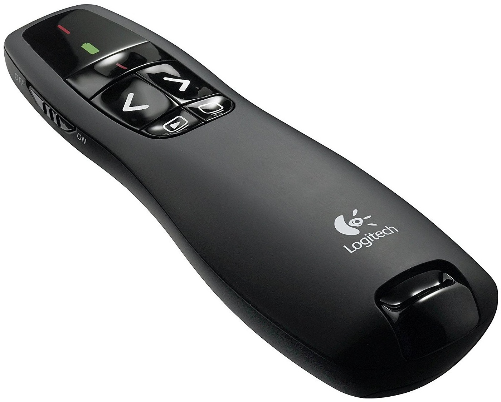

De afstandsbediening
=====================================

De afstandsbediening bevind zich in het voorvak van de laptoptas in een zwart hoesje. De ontvanger in de vorm van een USB-stick zit in het handvat geschoven en moet voorafgaand aan de presentatie op de laptop worden aangesloten. Aan de zijkant van de afstandsbediening zit een aan/uit schakelaar. Deze moet zo geschoven worden dat het groene vakje zichtbaar is. Hierbij zal ook op de bovenkant het batterijlampje kortstondig groen oplichten.

Onder het batterijlampje bevinden zich 5 knopjes. De bovenste, met het rode streepje, schakelt de laserpointer. Daaronder bevinden zich twee pijltjestoetsen waarmee de presentatie één stap verder of één stap terug genavigeerd kan worden. Op de onderste rij zijn nog twee knopjes. De linker start of stopt de presentatie. De rechter geeft een zwarte scherm weer in PowerPoint.

.. DANGER::
  Als de presentator gebruik maakt van de afstandsbediening, mag na het starten van de presentatie niet meer aan de laptop gezeten worden totdat de presentatie is afgerond. Dit om te voorkomen dat de afstandsbediening niet meer werkt. Dit gebeurt als iets anders actief wordt dan de basis presentatorweergave. Ook in het scherm waar alle dia’s worden weergegeven werkt de afstandsbediening dan niet!

  Als dit onverhoopt toch gebeurt kan handmatig de volgende dia op het scherm gezet worden door de beamerist. Als het goed is werkt de afstandsbediening dan weer.
