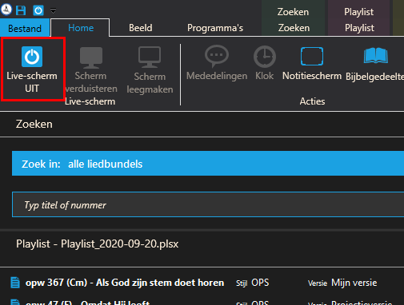
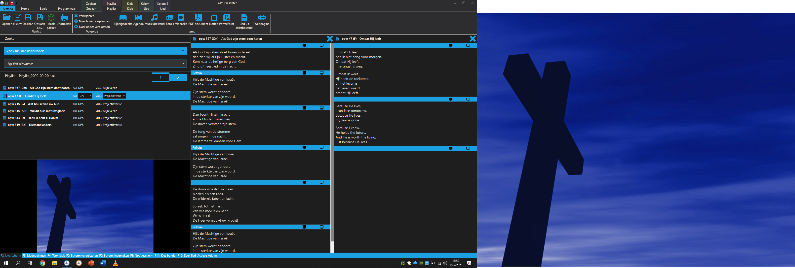
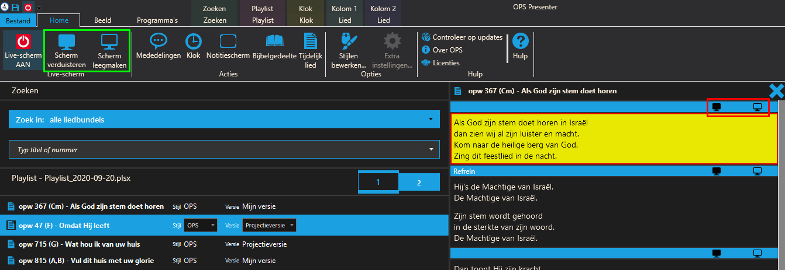

Liederen presenteren
====================
Als de beamer is aangesloten kan OPS gestart worden en de reeds voorbereidde playlist geopend worden.

Klik vervolgens in het lint (tabblad “home”) op “Live-scherm Uit” (of gebruik de sneltoets F2).

In het voorbeeldvenster en op de beamer zal de standaard blauwe achtergrond
zichtbaar worden.
Zet vervolgens de komende twee liederen alvast klaar in een kolom door er dubbel
op te klikken of door ze naar de gewenste kolom te slepen. Boven de playlist
staat een één en een twee, deze geven aan in welke kolom het lied geplaatst
wordt als er dubbel op geklikt wordt.

Door nu op een tekstblok te klikken, zal deze op het scherm verschijnen.

Als er tekst op het scherm geprojecteerd wordt kan het daaropvolgende tekstblok
aangeklikt worden om dat te tonen. Ook kunnen stukken overgeslagen worden of
overgeschakeld worden naar het volgende lied.

.. tip::
  Soms is het gebruik van sneltoetsen ook vrij handig. Gebruik bijvoorbeeld
  ``PgDn`` om naar het volgende tekstblok te springen en ``PgUp`` om het vorige
  tekstblok te tonen. ``Home`` voor het eerste tekstblok in een lied en ``End``
  voor het laatste.

Tussen liederen in of bij het overschakelen naar de PowerPoint is het aan te
raden om het scherm leeg of zwart te maken. Gebruik hiervoor de knoppen tussen
de tekst of in het lint onder het tabje “Home”.

.. tip::
  Ook de sneltoetsen ``F5`` voor verduisteren en ``F6`` voor leegmaken kunnen
  gebruikt worden.

