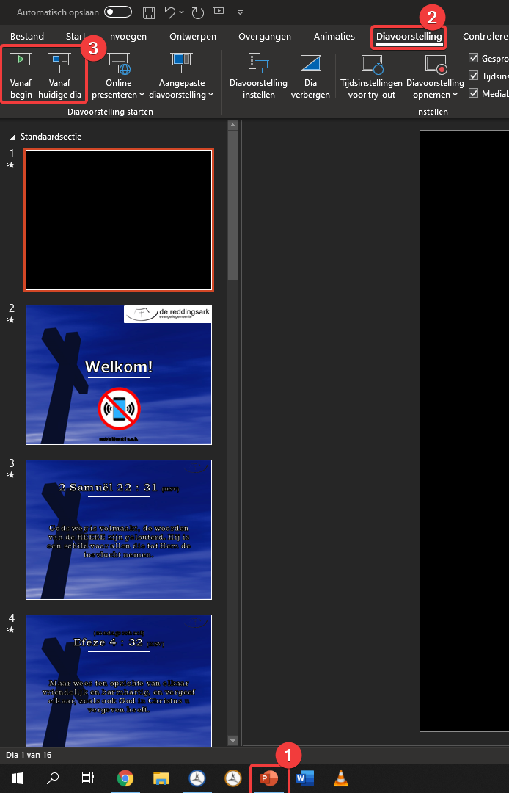

Overschakelen naar PowerPoint
=============================
Zorg dat tijdens de dienst de presentaties die gebruikt worden geopend zijn en
blijven. Dit voorkomt dat je in alle haast het bestand moet zoeken en vervolgens
moet wachten totdat de presentatie is geladen. Zoals hierboven ook al vermeld
staat, maak eerst het scherm leeg of zwart voor je overschakelt naar de PowerPoint.
Klik in de taakbalk op het PowerPoint icoontje. Klik daarna in het lint op
:guilabel:`Diavoorstelling` en desgewenst op :guilabel:`Vanaf begin` of :guilabel:`Vanaf huidige dia`.

.. Tip::
  In PowerPoint kan je ook de sneltoetsen ``F5`` of ``Shift`` + ``F5`` gebruiken.
  Deze sneltoetsen verschillen met de sneltoetsen binnen OPS!

Vervolgens opent op het laptopscherm de “presentatorweergave” en op het beamerscherm de eerste of geselecteerde dia (afhankelijk van de bovenstaande keuze).

PowerPointpresentatie afsluiten
===============================
Het afsluiten van de diavoorstelling is eigenlijk vrij simpel. Klik op het kruisje rechtsboven of druk op het toetsenbord op ``Esc``.

.. Tip::
  Ondanks deze simpele handeling blijkt in de praktijk dat het nog weleens fout gaat (bijvoorbeeld als rechtsboven op het minnetje of op het vierkantje gedrukt wordt. De presentatorweergave verdwijnt dan (naar de achtergrond). Als dit gebeurd, geen paniek. Klik in de taakbalk op het PowerPoint icoontje en sluit het venster met de titel :guilabel:`PowerPoint-diavoorstelling` door op het kruisje naast de titel te klikken. Het kruisje wordt zichtbaar als de muis hier overheen bewogen wordt.

  .. image:: ../images/pp-poef-afsluiten.png
