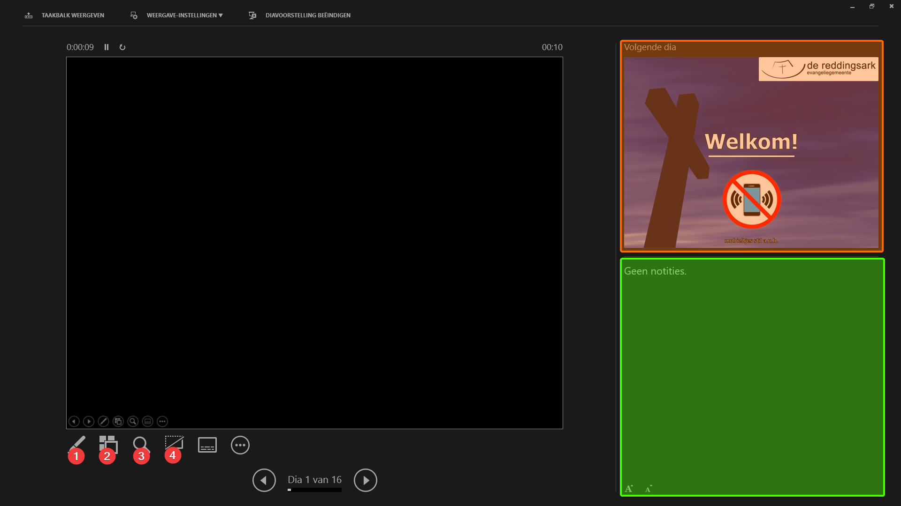

Presentatorweergave van PowerPoint
=====================================

De presentatorweergave is in een aantal vlakken opgedeeld. Het grote zwarte vlak
is de voorbeeldweergave van de gepresenteerde dia. Hierop staat hetzelfde als op
het beamerscherm. Rechtsboven (oranje) staat wat er op het scherm komt te staan
zodra er eenmaal voorwaarts geklikt wordt (dit hoeft niet direct de volgende dia
te zijn, het kan ook een animatie zijn).
Rechtsonder (groen) kunnen notities geplaatst worden door de spreker bij de
huidige dia. In de praktijk wordt dit niet vaak gebruikt.

Linksonder zijn nog een aantal knoppen genummerd:

1. Digitale aanwijzer of pen (opties bij klik)
2. Alle dia’s weergeven (zie onderstaande afbeelding). Om direct naar een dia te
   springen, als niet op volgorde gepresenteerd wordt. Dit komt vaak voor bij de
   mededelingen.
3. Vergrootglas. Hiermee kan ingezoomd worden op een deel van de dia.
4. Zwart scherm weergeven.

Middenonder staat de voortgang en pijlen naar links en rechts om een stap verder
of terug in de presentatie te gaan.

