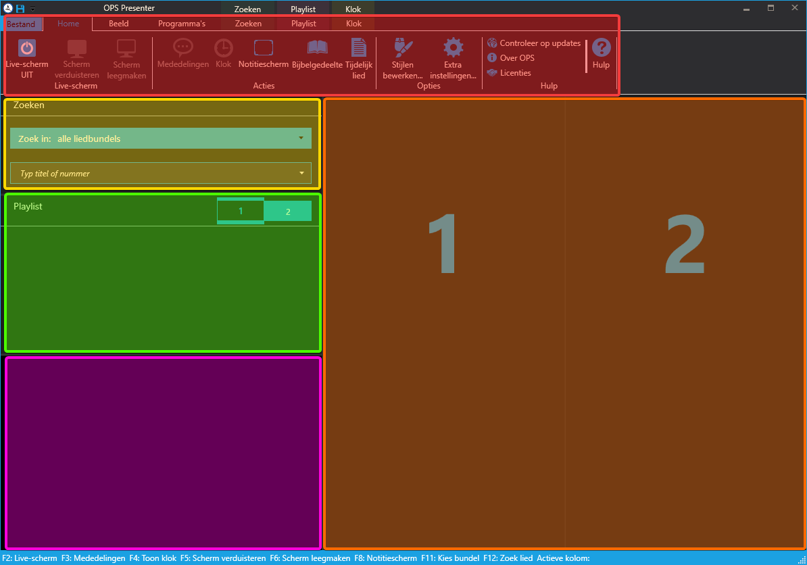

Inleiding
=========
Op de beamerlaptop staan drie programma’s die we gebruiken voor het presenteren: OPS Presenter, PowerPoint en VLC Media Player. OPS Presenter (verderop afgekort met OPS) is voor het presenteren van de liedteksten. PowerPoint is welbekend voor het tonen van presentaties. VLC Media Player wordt gebruikt voor het tonen van video’s.
Deze programma’s kunnen na opstarten op de taakbalk gevonden worden:

Na het openen van OPS verschijnt het volgende scherm. Dit scherm kan opgedeeld worden in 5 vlakken.

- Rood: Het Lint
- Geel: De liedzoeker
- Groen: De Playlist
- Roze: Het voorbeeldvenster
- Oranje: De kolommen.

