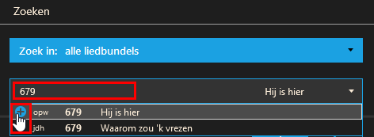
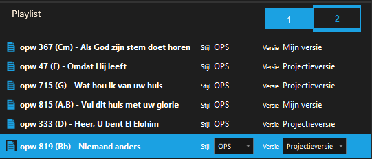
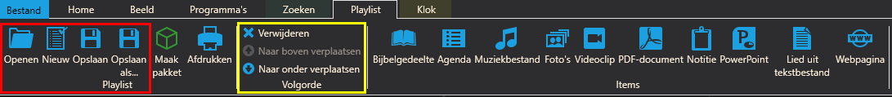
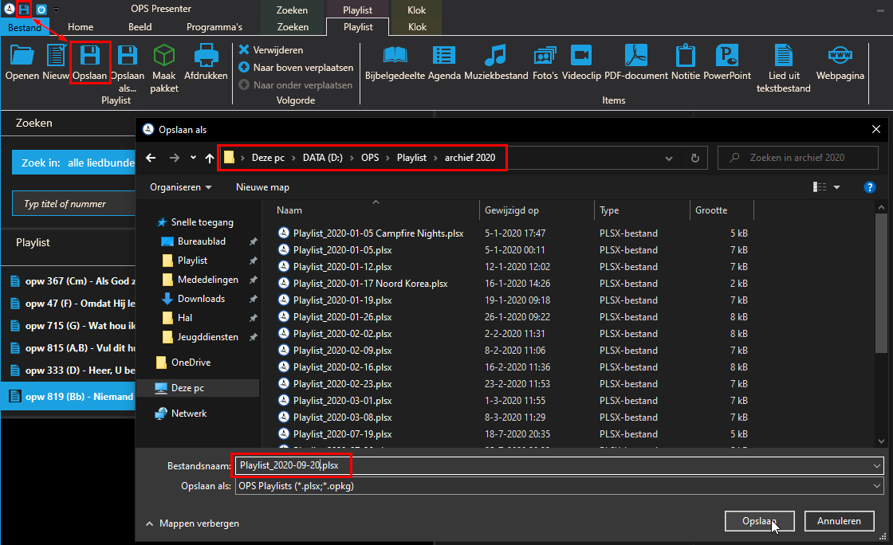

OPS Playlist maken
==================
Om een playlist te maken moeten als eerste liederen toegevoegd worden aan de playlist. Dit kan door een lied op te zoeken door het nummer of de titel in te typen in de liedzoeker. Tijdens het typen verschijnt een lijst waaruit het correcte nummer gekozen kan worden. Klik op het plusje voor de titel om het lied toe te voegen aan de playlist.

.. Tip:: Gebruik het toetsenbord en selecteer het lied met de pijltjestoetsen en gebruik de toetscombinatie ``Ctrl`` + ``Enter`` om het lied toe te voegen aan de playlist

Het lied staat nu in de playlist. Doe dit achtereenvolgens alle liederen die in de playlist moeten staan.

Klik één keer op de titel van een lied in de playlist om in het lint de opties voor de playlist zichtbaar te maken. Vanuit dit menu kan de playlist opgeslagen of geopend worden (rood). Ook kan de volgorde van de playlist gewijzigd worden door een titel aan te klikken en het lied naar boven of naar onder te verplaatsen (geel). Het lied kan hier ook uit de playlist verwijderd worden. Er kunnen ook nog andere zaken aan de playlist toegevoegd worden, hier maken wij echter geen gebruik van door eerdere vervelende ervaringen (vastlopers).

Sla het bestand op in de archiefmap van het huidige jaar en gebruik de standaard datumstructuur zoals OPS dat suggereert (``Playlist_yyyy-mm-dd``),  zodat alles netjes op volgorde blijft staan. Als het niet een gebruikelijke dienst betreft, maar een bijbelstudie of jeugddienst, voeg dit dan even toe aan de bestandsnaam.

