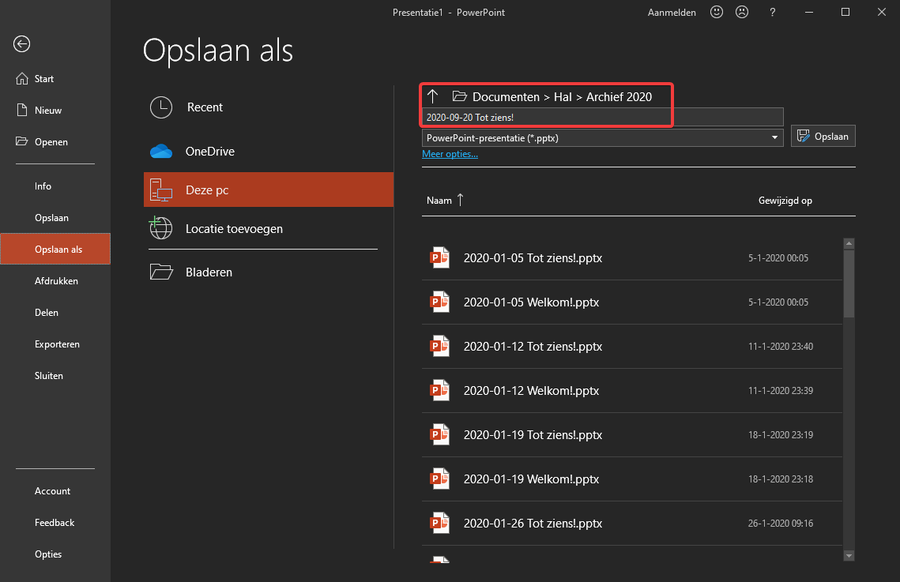
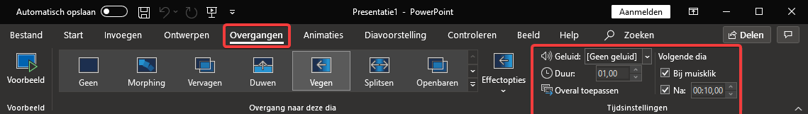

PowerPoint Hal
==============

De presentaties in de hal zijn inhoudelijk vrijwel hetzelfde als die van de mededelingen. Er wordt alleen veel minder getoond. Er worden twee presentaties gemaakt. Het enige verschil is de tekst “Welkom” of “Tot ziens” op de eerste dia.
Start de template van de welkomstpresentatie op dezelfde manier als de template van de mededelingen. Pas de agenda aan en sla de presentatie op in de correcte map met de standaardnaam ``yyyy-mm-dd Welkom!``.

De tot-zienspresentatie kan het makkelijkst op de volgende manier gemaakt worden:
Open de “Tot ziens” template zonder de welkompresentatie af te sluiten. Kopieer een plak de agenda dia van de welkomstpresentatie in de tot-zienspresentatie en verwijder de standaard agenda dia uit die presentatie. Doe hetzelfde met eventuele andere gewijzigde of toegevoegde dia’s.
Sla de presentatie op in dezelfde map als de welkomstpresentatie met dezelfde naamgeving (verander dan uiteraard “Welkom!” In “Tot ziens!”).

Als er dia’s toegevoegd worden aan de welkomst-/tot-zienspresentatie, let er dan even op dat de automatische overgang na 10 seconden ook wordt toegevoegd. (In het lint tabblad :guilabel:`overgangen` en dan helemaal rechts). Dit zorgt er voor dat de presentatie uit zichzelf doorgaat naar de volgende dia, zonder dat er doorgeklikt hoeft te worden.

