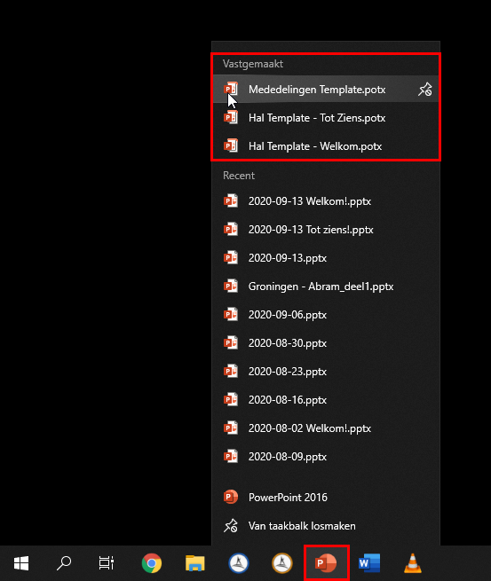
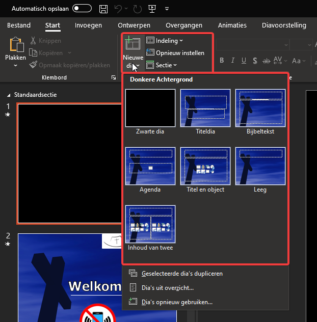
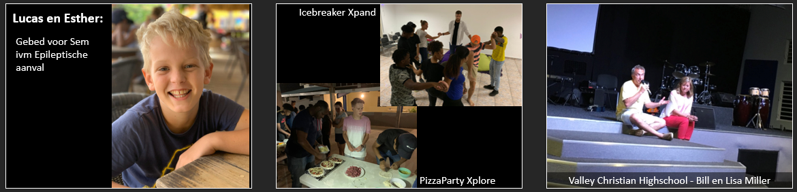
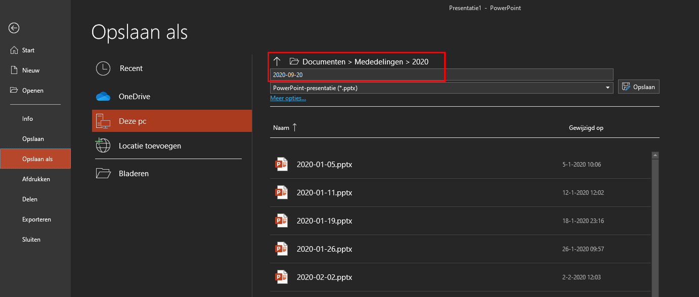

PowerPoint Mededelingen
=======================
Voor de presentaties van de mededelingen en de presentaties in de hal zijn templates beschikbaar. Hierdoor hoeft niet de hele presentatie elke week opnieuw gemaakt te worden. De makkelijkste manier om de template te openen is om met de rechtermuisknop op het PowerPoint-icoon te klikken in de taakbalk. Boven in de lijst die zichtbaar wordt staan de templates. Open de template door er op de klikken.

Na het openen staan aan de linkerkant alle dia’s die normaal gesproken tijdens de dienst gebruikt worden. Klik de betreffende dia’s aan en pas de inhoud aan naar dat wat in het mededelingenblad staat. Een nieuwe dia invoegen met bestaande opmaak kan via het menu. De indeling van een bestaande dia aanpassen kan ook hier.

Als er de vraag is om afbeeldingen tijdens de dienst te tonen, voeg ze dan toe aan de presentatie voor de mededelingen. Doe dit door een nieuwe zwarte dia in te voegen en dan de afbeelding aan die dia toe te voegen. Zo verstoord de standaard blauwe achtergrond niet de inhoud van de foto.
Voeg als er ruimte is nog even een korte tekst toe moet de omschrijving van wat er op de foto getoond wordt. Zo kan de foto ook getoond worden als de mededelingenbroeder het vergeet te noemen tijdens zijn praatje. Let er op dat er voldoende contrast is tussen de letters en de achtergrond. Voeg desnoods een (half)zwarte achtergrond toe aan het tekstvak.

Sla de presentatie op in de map van het huidige jaar en gebruik de naamgeving ``yyyy-mm-dd`` (bijv. 2020-09-20).

